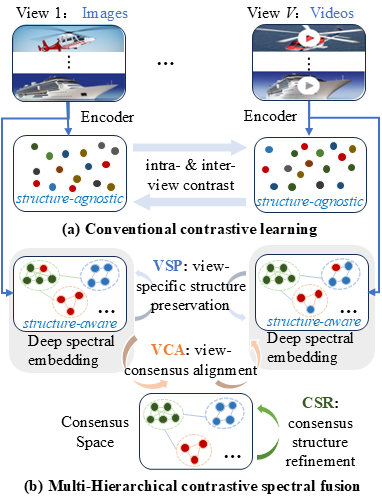

<p align="center">
    <h1 align="center">Multi-Hierarchical Contrastive Spectral Fusion for Multi-View Clustering</h1>
    <p align="center">
      <strong>Bing Cai</strong><sup>1</sup>,
      <strong>Xiaoli Wang</strong><sup>2</sup>,
      <strong>Gui-Fu Lu</strong><sup>3</sup>,
      <strong>Zechao Li</strong><sup>1</sup><em>*</em>
    </p>
<p align="center">
  <sup>1</sup>Nanjing University of Science and Technology<br>
  <sup>2</sup>Nanjing Forestry University<br>
  <sup>3</sup>Anhui Polytechnic University
</p>

<p align="center">
  {bingcai, zechao.li}@njust.edu.cn, xiaoliwang@njfu.edu.cn, lu-guifu@ahpu.edu.cn
</p>

## Abstract
Multi-view contrastive clustering has emerged as a powerful paradigm for learning comprehensive representations from heterogeneous data sources. However, prevailing approaches typically overlook the intrinsic geometric and clustering structures, rendering them structure-agnostic.  In this paper, we propose a novel framework that performs Multi-Hierarchical Contrastive Spectral Fusion (MCSF) to address these limitations. MCSF integrates deep spectral embedding into the encoder to preserve local manifold structure, guiding the learned representations to be clustering-friendly.  To enhance cross-view consistency, MCSF introduces a multi-hierarchical contrastive loss jointly optimizing (1) view-specific structure preservation, (2) view-consensus alignment, and (3) consensus structure refinement. This mechanism enables the construction of an accurate and semantically consistent consensus representation, effectively fusing multi-view information and uncovering authentic cluster structures. Extensive experiments on benchmarks validate the effectiveness of multi-hierarchical contrastive spectral fusion in clustering accuracy and representation quality.

<div align="center">
</div>

## Requirements

``` shell
pytorch>=2.1.0 

numpy>=1.23.0

scikit-learn>=1.5.2

munkres>=1.1.4
```

## Run

```
/MCSF/main.py
```

## Note

If you have any question, please contact this e-mail: [bingly@foxmail.com](mailto:bingly@foxmail.com).

